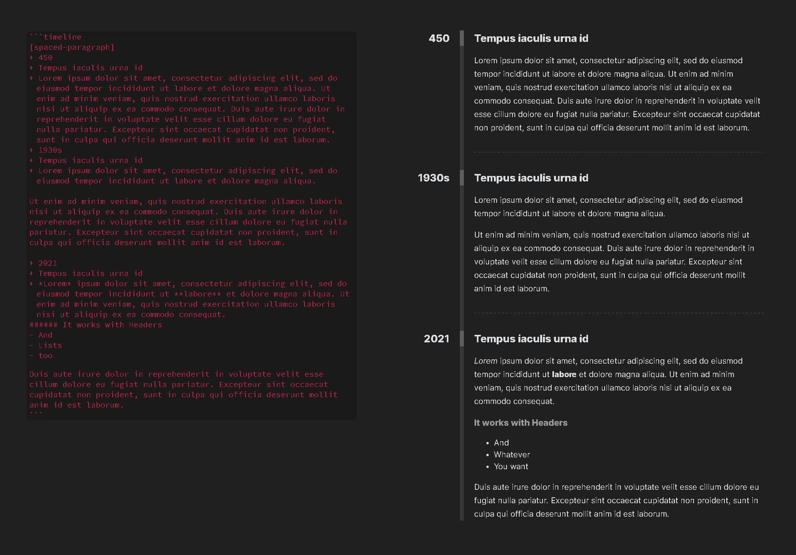

## Example

Use `+` at the beginning of each line:

- each event has 3 `+`s at the beginning of the line for time, header and description
- you can separate them with empty lines if it's easier for you to write

`[]` is optional!

You can use `[]` at the beginning of the code-block to add pre-written classes or your own classes to the wrapper. 
Example: `[spaced-paragraph, your-class, even-more]` 
The list of all pre-written classes:

- **white**/**black** changes the main vertical line and dashed line to white/black
- **spaced-paragraph** increases the default gap between lines in description's paragraphs

The time, header and description of each event can do everything Obsidian.md can do
